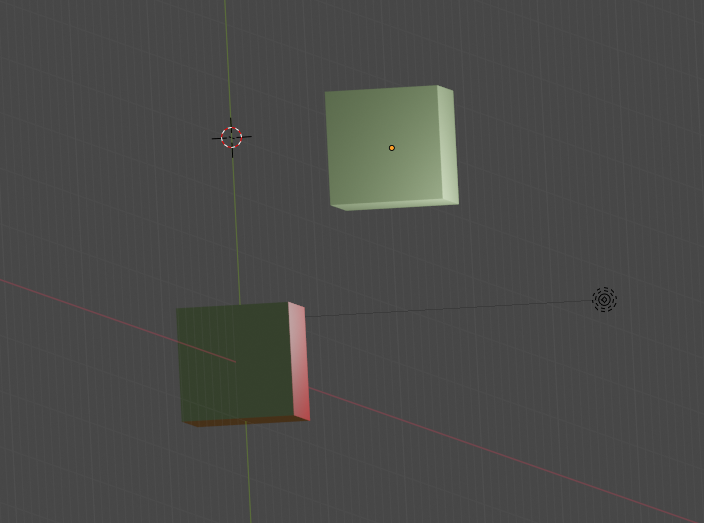

# Day 19: Beacon Scanner

## Run

```
cat assets/input.txt | cargo run
```

## Bench

```
cat assets/input.txt | cargo bench
```

## Notes

Oh boy, I wish I was good at Rubik's Cube. At least it's still just
3 dimensions for this problem. So to have some understanding of the 
problem, I grabbed something that had unique features from every angle,
which happened to be a kitchen mitten, and enumerated all the different
90 degree angles for it, while drawing the shapes. Then I proceeded to
download Blender 3D.

I've never used Blender 3D before, so following some various tutorials,
I created a 3D cube and another 3D cube with X distance 1,
Y distance 2 and Z distance 3. I painted each facet of the reference cube to
a different color, so that I could keep track of which angle I was looking at,
went through every angle I had drawn for the kitchen mitten, and noted down
relative distances in a spreadsheet.

Here is how x = 1, y = 2 and z = 3 looks like in Blender 3D:


Afterwards, I pretty much brute forced the results, without any optimizations,
and technically the solution could provide incorrect results, if solution 
paths diverged.

Local benchmark results:

* parse: 62 μs
* part 1: 196 ms
* part 2: 198 ms
